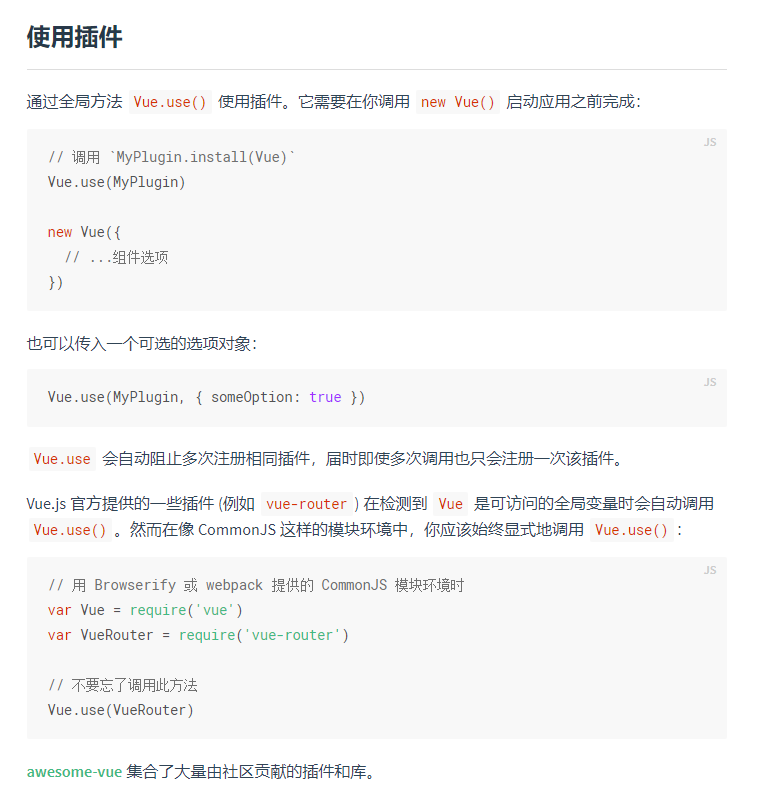
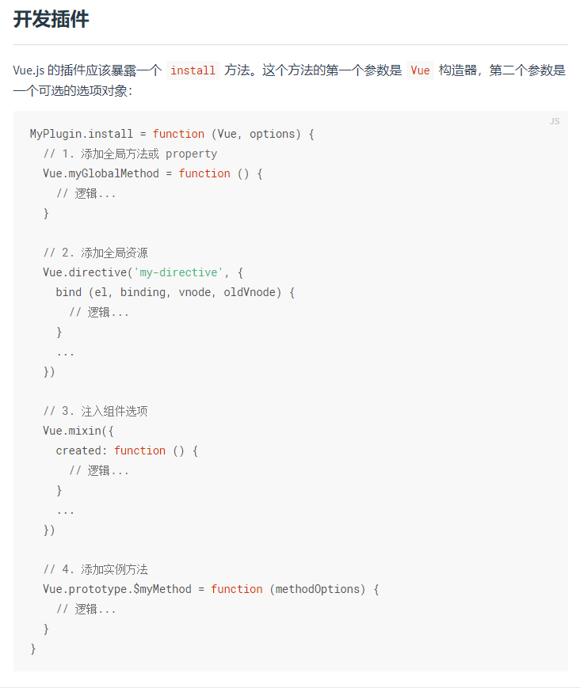
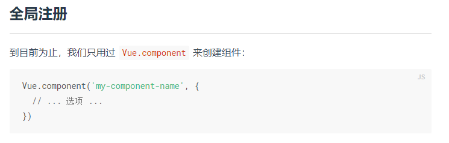
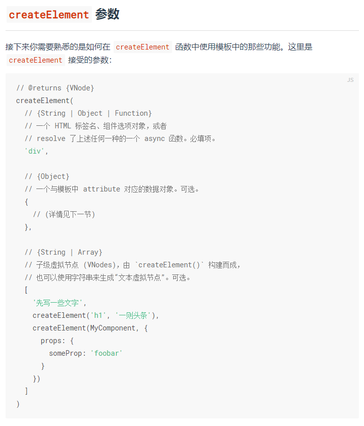
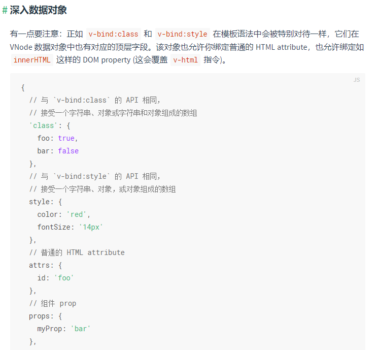
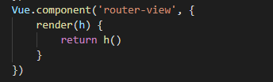
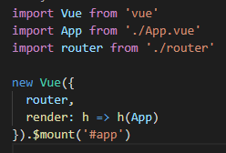
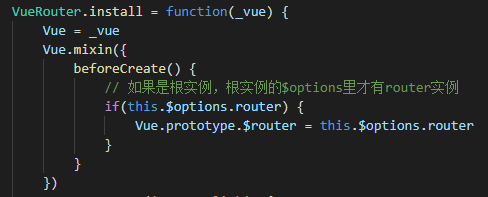
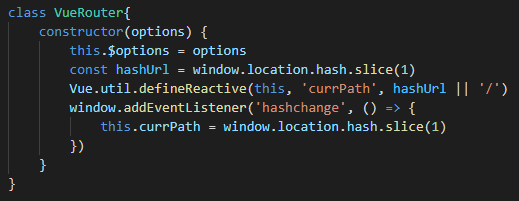
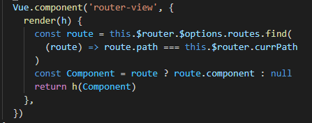

# 手写实现mini-VueRouter

在spa的应用程序中,url发生变化的时候，页面不进行刷新，也能显示对应的视图。Vue Router 是 [Vue.js](http://cn.vuejs.org/)官方的路由管理器，下面我们来研究一下它的原理 

#### vue-router 使用步骤

核⼼步骤： 

- 步骤⼀：使⽤vue-router插件，router.js 

```javascript
import Router from 'vue-router'
Vue.use(Router)
```

- 步骤⼆：创建Router实例，router.js 

```javascript
export default new Router({...})
```

- 步骤三：在根组件上添加该实例，main.js 

```javascript
import router from './router'
new Vue({
 router,
}).$mount("#app");
```

- 步骤四：添加路由视图，App.vue 

```javascript
<router-view></router-view>
```

- 导航

```javascript
<router-link to="/">Home</router-link>
<router-link to="/about">About</router-link>
```

```javascript
this.$router.push('/')
this.$router.push('/about')
```

看完vue-router使用步骤之后我们有这几个疑问：

1. Vue.use是什么
2. 为什么要在根组件上添加VueRuter实例(router)
3. 我们平时为什么可以在组件里直接使用this.$router
4. 为什么我们可以直接使用router-link，router-view

通过阅读vue文档我们可以得知Vue.use是[使用插件](https://cn.vuejs.org/v2/guide/plugins.html)的方法

  

由文档可以得知vue-router是一个官方提供的插件

通过vue文档的[开发插件](https://cn.vuejs.org/v2/guide/plugins.html)我们可以知道怎么开发一个插件

 

有了这些基础知识后，我们就可以进行mini-vue-router的开发了。在开发之前我们要了解vue-router的基本原理

#### vue-router的基本原理

监听URL变化的地址，然后去和配置里的路由器进行匹配，然后拿到对应的Component，然后渲染在router-view容器组件上。

##### 搭建基础架构

- 实现VueRouter类
- 实现install方法

```javascript
let Vue // 保存Vue构造函数，插件中要使用，不导入还能用
class VueRouter {
    constructor (options) {
        this.$options = options
    }
}
// Vue.use()调用的时候会执行内部的install方法
VueRouter.install = function (_vue) {
    Vue = _vue
}

export default VueRouter
```

install被调用的时候，会把Vue的构造函数传进来，主要是为了这个独立的插件将来打包的时候不用把Vue打包进去。import Vue from 'vue' 打包会把整个Vue打包进来

##### 实现router-link，router-view全局组件

我们可以直接使用router-link，router-view，是因为这两个是全局组件

我们看看官方关于[全局注册](https://cn.vuejs.org/v2/guide/components-registration.html)组件的描述

 

router-link，router-view的实现代码

```javascript
VueRouter.install = function(_vue) {
    Vue = _vue
    Vue.component('router-link', {
        props: {
            to: {
                type: String,
                require: true
            }
        },
        render(h) {
            return h('a', {attrs: {href: '#' + this.to}}, this.$slots.default)
        }
    })
    Vue.component('router-view', {
        render(h) {
            // 这里动态渲染
            return h()
        }
    })
}
```

我们使用render函数而不用template模版，是因为vue-cli环境下默认vue包是不带编译器的

h即是[createElement](https://cn.vuejs.org/v2/guide/render-function.html#createElement-参数)渲染函数



[深入数据对象](https://cn.vuejs.org/v2/guide/render-function.html#深入数据对象)

 

##### router-view动态渲染的思路

 

1. 获取hash #url，通过`window.location.hash`获取
2. 根据上面的地址获取对应的组件配置（`Component`)，那么怎么获取呢？
3. `h(Component)` ，通过h函数渲染组件
4. 注意：`h`函数可以直接渲染一个组件

我们平时可以任何组件里面使用`this.$router`，那么在`router-view`组件里也可以使用，那么`this.​$router`怎么来的

##### 注册$router

这个VueRouter实例在最开始的main.js的时候就注入了

 

这个router实例就可以在install里面利用混入mixin进行延迟执行注册

 

install执行的时候VueRouter还没实例化，所以要进行混入(mixin)

##### 获取hash 

 

利用`Vue.util.defineReactive`设置当前的`currPath`为响应式数据，⼀旦变化，动态重新执⾏render 


##### 根据url显示对应的内容

 

监听hashchange变化的地址，然后去和配置里的路由器进行匹配，然后拿到对应的Component，然后渲染在router-view容器组件上

#### 完整代码

```javascript
let Vue
class VueRouter {
  constructor(options) {
    this.$options = options
    const hashUrl = window.location.hash.slice(1)
    Vue.util.defineReactive(this, 'currPath', hashUrl || '/')
    window.addEventListener('hashchange', () => {
      this.currPath = window.location.hash.slice(1)
    })
  }
}

VueRouter.install = function(_vue) {
  Vue = _vue
  Vue.mixin({
    beforeCreate() {
      // 如果是根实例，根实例的$options里才有router实例
      if (this.$options.router) {
        Vue.prototype.$router = this.$options.router
      }
    },
  })
  Vue.component('router-link', {
    props: {
      to: {
        type: String,
        require: true,
      },
    },
    render(h) {
      return h('a', { attrs: { href: '#' + this.to } }, this.$slots.default)
    },
  })
  Vue.component('router-view', {
    render(h) {
      const route = this.$router.$options.routes.find(
        (route) => route.path === this.$router.currPath
      )
      const Component = route ? route.component : null
      return h(Component)
    },
  })
}

export default VueRouter
```

